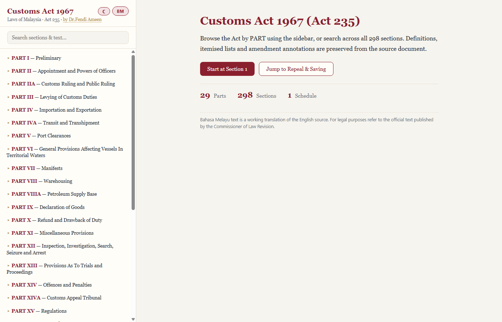
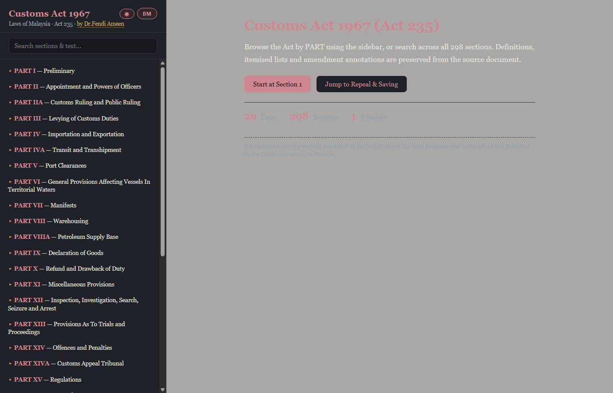

# Akta Kastam 1967 — Digital Customs Act 1967 (Act 235)

A bilingual (English / Bahasa Melayu) reader for Malaysia's **Customs Act 1967 (Act 235)**, covering all **298 sections** with a faithful structural mirror of the source document.

By **Dr.Fendi Ameen** · [afandi.amin@customs.gov.my](mailto:afandi.amin@customs.gov.my)

## Screenshots

| Light | Dark |
|---|---|
|  |  |

---

## Features

- **Full Act, both languages** — every section translated to Bahasa Melayu, with a one-click language toggle (EN ⇄ BM). Sections without a translation fall back to English automatically.
- **Browse by PART** — collapsible sidebar groups all parts (BAHAGIAN I–XVII) with localized part titles.
- **Full-text search** — case-insensitive search across section numbers, headings, and body text, with instant results.
- **Shareable links** — every section has its own URL (`#s-15`), so you can bookmark or share links; browser back/forward works.
- **Bookmarks** — star any section (☆ → ★) and it appears in a sidebar bookmarks tab with a count badge, persisted in `localStorage`.
- **Keyboard shortcuts** — `←`/`→` to page between sections, `/` to focus search, `Esc` to clear.
- **Adjustable text size** — A− / A+ controls in the sidebar; reading font size persists like the theme.
- **Recently viewed / resume reading** — the welcome screen shows a *Continue reading* card for your last-read section plus the 5 most recent ones, persisted in `localStorage`.
- **Schedule & savings note** — the Act's Schedule (section 169) is browsable and shareable at `#schedule`, with print support.
- **Context-aware TOC** — the sidebar auto-expands the PART containing the current section and scrolls it into view.
- **Back to top** — a floating button appears after scrolling a full section.
- **Cross-reference links** — citations like "section 65A" or "sections 12, 13 and 14" in section text are clickable and jump within the app; hovering shows a preview of the target section's PART, heading, and an opening-line snippet (localized in BM), and clicking the preview opens the full section in a browseable overlay (prev/next buttons and arrow keys) — no page navigation required. Citations to other laws are left as plain text.
- **Light / dark theme** — toggle in the sidebar; respects OS preference on first visit, persists choice in `localStorage`, no flash on load.
- **Print support** — per-section print button with a clean print stylesheet (sidebar/pager hidden, black-on-white) and a footer crediting the source:
  *"Printed from DrFendi's · afandi.amin@customs.gov.my · Digital Customs Act 1967"*.
- **Amendment annotations** — inline statutory citations (e.g. `[Amd. S6 Act A1593 w.e.f. 1/1/2020]`) preserved and rendered as chips.
- **Deleted sections** — repealed/omitted sections and ranges shown with strikethrough and an explanatory note.
- **Disclaimer** — a prominent notice on the home page (and in every printout) clarifying this is an unofficial convenience reference and pointing to the authoritative text at [lom.agc.gov.my](https://lom.agc.gov.my).
- **Zero backend** — static SPA; all data is embedded JSON.

## Tech stack

React 19 · TypeScript · Vite 6 · plain CSS (no UI framework)

## Getting started

```bash
npm install
npm run dev        # dev server (http://localhost:5173)
npm run build      # typecheck + production build → dist/
npm run preview    # serve the production build locally
```

## Data pipeline

The Act's text lives in two JSON trees, kept structurally aligned block-for-block:

| File | Purpose |
|---|---|
| `src/data/customs-act.json` | English source, parsed from the raw PDF text by `scripts/generate-data.mjs` |
| `src/bm/customs-act-bm.json` | Bahasa Melayu translation, **generated** — do not edit by hand |
| `src/bm/bm-batch-1…16.mjs` | BM translation source of truth, one batch file per section range |

```bash
npm run gen:data         # regenerate English JSON from extracted_raw.txt
node scripts/merge-bm.mjs   # validate + merge BM batches → customs-act-bm.json
node scripts/diff-blocks.mjs s-10C s-123   # debug EN/BM block alignment
```

`merge-bm.mjs` enforces a 1:1 block-count match with the English source (including quote blocks and their items) and refuses to write the merged file on any mismatch — this keeps both languages structurally identical.

## Deployment

### Render (auto-deploy from GitHub)

`render.yaml` in the repo root defines a **static site**: `npm ci && npm run build`, publishing `dist/` with immutable asset caching, no-cache HTML, and an SPA rewrite fallback.

1. Render dashboard → **New** → **Blueprint** → pick this repo
2. Render reads `render.yaml` and provisions the site
3. Every push to `main` auto-deploys

### cPanel (static upload)

```bash
npm run deploy          # builds, then zips dist/ → customs-act-dist.zip
```

Upload `customs-act-dist.zip` via cPanel File Manager into `public_html/` (or any subfolder), **Extract**, delete the zip. The build uses relative asset paths (`base: './'`), so it works at a domain root or any subdirectory without rebuilding.

Optional `.htaccess` for caching + gzip:

```apache
<IfModule mod_expires.c>
  ExpiresActive On
  ExpiresByType text/css "access plus 1 year"
  ExpiresByType application/javascript "access plus 1 year"
  ExpiresByType text/html "access plus 0 seconds"
</IfModule>
<IfModule mod_deflate.c>
  AddOutputFilterByType DEFLATE text/html text/css application/javascript
</IfModule>
```

### Any other static host

`dist/` is plain static files — GitHub Pages, Netlify, Cloudflare Pages, S3, nginx all work as-is.

## Translation disclaimer

The Bahasa Melayu text is a **working translation** of the English source. For legal purposes, refer to the official text published by the Commissioner of Law Revision.
